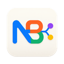
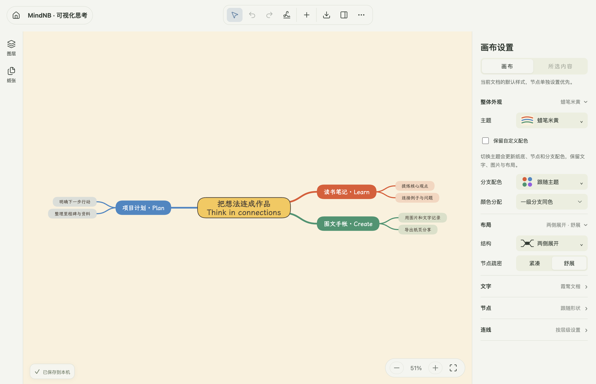
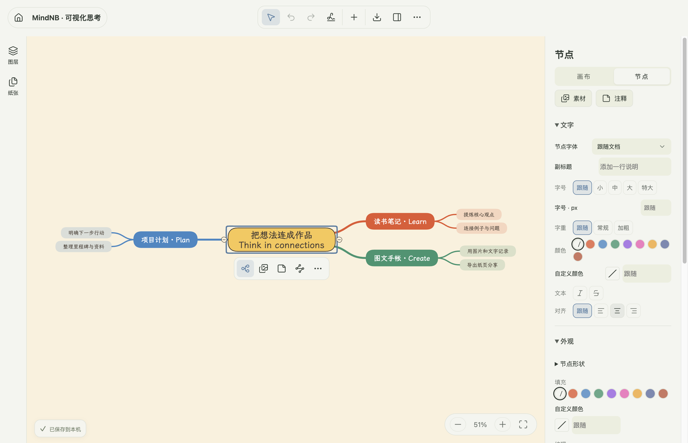

# MindNB

**English · [简体中文](README.zh-CN.md)**

### Connect ideas. Think visually. Keep your files.

MindNB is a free, open-source desktop editor for mind maps, visual notes and illustrated journals. Organize a branching idea, add images and editable diagrams, then arrange the result on an open canvas or paper pages. Your desktop documents and images live in a local folder you choose; everyday editing works offline without an account.

[Downloads](https://github.com/Ethan-Tang-2035/MindNB/releases) · [Build from source](docs/development.md) · [Contributing](CONTRIBUTING.md) · [AGPL-3.0 license](LICENSE)



## Download

**[Download MindNB 0.1.0 Preview](https://github.com/Ethan-Tang-2035/MindNB/releases/tag/v0.1.0).** Installers are available for the four targets below. All passed automated build, installation smoke and desktop checks. These are unsigned preview packages; macOS packages are not Apple-notarized. See the release notes for validation details and limits.

| System | Architecture | Download file |
| --- | --- | --- |
| macOS, Apple Silicon | arm64 | `MindNB-<version>-mac-arm64.dmg` or `.zip` |
| macOS, Intel | x64 | `MindNB-<version>-mac-x64.dmg` or `.zip` |
| Windows | x64 | `MindNB-<version>-win-x64.exe` installer or `.zip` |
| Linux | x64 | `MindNB-<version>-linux-x86_64.AppImage` |

Choose your system and processor under **Assets**. GitHub's automatic “Source code” archives are for developers. Every published release should include installation notes, signing status and `SHA256SUMS.txt`. See [installation and verification](docs/open-source/install.md). Windows ARM, Linux ARM, mobile apps and automatic updates are not currently verified release targets.

## What makes MindNB useful

- **Thinking and presentation in one document.** Mix mind maps with text boxes, images, stickers, editable tables, timelines, flow diagrams and handwritten strokes. Organize content into paper pages for sharing.
- **Structure each branch independently.** Combine logic maps, balanced maps, organization charts, trees, fishbones and journal structures. Use folding and focused subtree views to explore details.
- **Fast, visible editing.** Create nodes with Tab and Enter, drag branches with a landing preview, detach and reconnect subtrees, and undo or redo edits.
- **A canvas with character.** Choose paper textures, handwritten typography, branch colors and light or dark themes. Control individual nodes when the default style needs adjustment.
- **Files you can carry with you.** Export an editable `.mindnb` package with its assets. Share images and documents in PNG, JPEG, SVG, PDF, Markdown, Word, Excel, OPML or TextBundle. Export fidelity differs by format; `.mindnb` preserves editable structure.
- **Optional agent integration.** A bundled MCP server lets a compatible local client read and edit a document through the desktop bridge. The client may use external AI services; check its data settings before connecting private documents.



## Start with your own ideas

1. Install a build for your system and choose a local vault folder.
2. Create a document. Use **Tab** for a child node and **Enter** for a sibling.
3. Add visual content and choose a branch structure or paper layout.
4. Export `.mindnb` to move an editable copy, or PDF / an image to share.

Reading notes, project plans and visual journals are good starting points. The editor currently has predominantly Chinese interface labels; the English README does **not** imply a fully English interface.

## Storage and current limits

Desktop editing uses your local vault. Importing a `.mindnb` file copies it into that vault; subsequent edits do not overwrite the original imported package. Export again to share changes. Keep backups before upgrading preview versions. Vault files are not encrypted by MindNB.

The browser edition uses browser storage and optionally a self-hosted remote service. That service uses a shared access key for a single-user/private deployment; it is not a public multi-user hosting service. Cloud-folder synchronization, including iCloud, has not been certified for concurrent editing. See [privacy and security](SECURITY.md).

## Development and community

Use Node.js 24 or newer:

```bash
npm ci
npm run dev
npm test
npm run typecheck
npm run build:desktop
npm run package:desktop -- --publish never
```

macOS desktop builds require the Swift toolchain and accepted SDK licenses. Build each installer on its target system; [development](docs/development.md) and [release guide](docs/open-source/releasing.md) explain the checks.

For feedback, include your OS, processor, app version, reproduction steps and a minimal example with private content removed. See [contribution guidance](CONTRIBUTING.md); internal work is tracked as local Markdown tickets.

## License and acknowledgements

Original project code is licensed under [AGPL-3.0-only](LICENSE). Commercial use is permitted under its terms. Distributing modified versions and offering modified versions over a network brings corresponding-source obligations; provide the exact source and build instructions for each release. Fonts, illustrations and dependencies retain their [own licenses](THIRD_PARTY_NOTICES.md). MindNB is an independent project; third-party names do not imply affiliation or endorsement.
